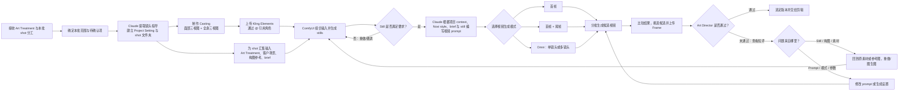

# Current State User Flow — Lucas

## 流程定位

这份 current-state user flow 描绘 Lucas 在一个分阶段交付的 AI 影视项目中，如何把 art treatment 中的镜头要求转化为 still/reference image 与视频候选，并依据评审结果回溯、返工。

它聚焦**当前实际操作顺序、分支、判断和回路**，不是用户旅程地图：不以体验阶段或情绪变化为主轴，也不把 Lucas 的个人做法泛化为团队标准。流程从 Lucas 收到 art treatment 和镜头分工开始，以候选通过评审并交接，或回到相关制作步骤继续迭代结束。

- **用户：** Lucas，AI 影视制作参与者；本图只代表其个人补档中的工作方式。
- **主要目标：** 为 art director 提供符合客户要求及 Novi & Associates 审美、可供剪辑使用的 shot。
- **流程重点：** 整理项目/shot 输入、制作并筛选 still、编写视频提示词、选择生成模式、对比候选、根据 Frame 反馈迭代。
- **系统/接触点：** Art Treatment、Claude、Nano Banana、ComfyUI、Kling AI / Elements、Frame、本地文件夹。

## 当前流程总览



## 步骤与分支细节

| 步骤 | Lucas 当前怎么做 | 判断与分支 | 主要阻力 / 证据 |
|---|---|---|---|
| **1. 接收批次与镜头范围** | 收到 art treatment 和本轮镜头分工；项目可能分批制作，首批可能先交一部分明确内容或先验证方向。 | 判断哪些 shot 现在制作、哪些等客户确认；第二批可能沿用、修改或推翻前一批。 | 批次范围会变。沿用部分基础 context/参考，通常仍需重做 prompt 和/或 reference image。（Lucas） |
| **2. 建立项目与 shot 输入** | 让 Claude 提取 art treatment 的逐镜头指导、项目背景与图片资料，建立 Project Setting、batch、scene/shot 等文件结构，并保存每个 shot 的静态要求。 | 一个 shot 文件夹作为固定信息和后续版本的归属点；具体层级可能按 shot 或 scene 管理。 | 前置整理通常需约 2–3 小时；Lucas 估计大量说明在重复交代项目和目录用法。（Lucas 的个人估算） |
| **3. 建立 Casting 并准备 still 输入** | 按 art treatment 用 Nano Banana 制作角色面部三视图、全身三视图，上传为 Kling Element；为 still 准备角色、客户真实场景/建筑、art-treatment 构图参考、色调/细节和个人 shot brief。 | 若 art treatment 的构图描述具体，探索范围较窄；若较开放，就多试角度、景别或机位。Casting 参考通过 Kling Elements 引用；其他输入仍需在 ComfyUI 工作流中组合。 | 输入要手动复制/放入工作流。多种参考若冲突，应在 still 阶段解决；Lucas 通常不希望冲突一路带入视频生成。（Lucas） |
| **4. 生成、筛选并细调 still** | 在 ComfyUI 生成多张静帧，人工检查人物、真实场景、构图及风格，再选定一张或继续调整。 | **Still 不合适：** 把图拖回 ComfyUI 找原节点参数；可从 raw materials 重做，或基于已选图图生图。**Still 合适：** 进入视频 prompt 阶段。 | 回溯节点和素材需要手动操作；从 raw 重做可能要多轮抽样，图生图更快但可能损失画质。筛选与来源对应不够顺手。（Lucas） |
| **5. 编写 prompt 并选择视频模式** | 让 Claude 结合项目 context、Novi & Associates 的审美取向、Lucas 的 shot brief 与 still，扩写视频生成 prompt。Novi style 强调角色与环境的空间关系、生活感与呼吸感。 | 根据镜头需要尝试首帧、首尾帧、Omni 单镜头或 Omni 多镜头；Omni 可用一张描述空间的参考图生成最多 3 个镜头、总长最多约 15 秒。 | 不同模式、prompt 和 still 构成分支；生成后的视频有时与 prompt/参数分开存放，难复刻具体组合。（Lucas） |
| **6. 分批生成与挑选候选** | 用可灵 AI 分批生成视频；比较方向不同的候选，挑选符合要求的版本上传 Frame。 | 生成不理想时，要判断是 still、prompt、模式还是随机结果所致，再选相应环节重试。共享账户同一时刻最多运行 20 条视频生成，超出部分排队。 | 结果随机且来源可能脱链；分支增多后不易知道哪个候选对应哪张 still、哪条逐镜头 prompt、模式和参数。共享并发带来等待。（Lucas） |
| **7. Frame 评审与回溯** | Art director 在 Frame 对候选给通过/不通过和简短文字意见；Lucas 自行判断应回到 still、prompt、模式还是参数。 | **通过：** 选定版本交给剪辑。**不通过：** 若是构图/素材问题回到 still 或 raw inputs；若是动态/prompt 问题改 prompt 或模式，再生成候选并回 Frame。 | 短评直接，但不一定指明应回到哪一制作环节；替换 reference image 后，和最新视频版本之间可能失去关联。（Lucas） |

## 生成分支与版本组织

Lucas 的个人文件结构可概括为：

```text
Project (e.g., 101 Franklin)
├── Project Setting
├── Batch 01 / Batch 02 ...
│   └── Scene / Shot
│       ├── Shot context + art-treatment guidance
│       ├── Casting / still references / shot brief
│       └── Version 01 / Version 02 ...
│           ├── Keyframe mode candidates
│           ├── Start + end keyframe candidates
│           └── Omni single-shot / multi-shot candidates
└── Shared casting references / Kling Elements
```

这个结构是 Lucas 的个人管理习惯，不是团队统一标准。实际困难在于，候选视频、提示词、参考图及参数可能分开保存；如果在版本后段发现 still 有问题，回到前序修改后，新的 still 又可能无法清楚关联到之前的视频候选和有效设置。这样便形成“分支—选择—反馈—回溯—再分支”的反复迭代，而不只是单向的生成步骤。

## 观察到的流程摩擦

- **重复准备：** Claude 可以帮助整理和执行，但前提是 Lucas 先把项目背景、输入输出和文件结构说明清楚；这段准备本身耗时。
- **手动搬运：** Casting、真实场景、构图参考和 shot brief 要分别进入相应工作流，产生大量复制、上传和组合操作。
- **筛选与追溯断裂：** 选中的 still 或视频不一定能直接展示精确的 prompt、参考素材、生成模式及参数。
- **迭代回路不稳定：** 评审意见可能要求回到 still、raw input、prompt 或模式；回改后需要重新确认哪些输入和设置仍有效。
- **共享生成队列：** 同一时刻最多 20 条视频可运行，超出的工作排队；并发限制是账户层面的，不是每天或每人配额。

Lucas 表示希望用更短的总时间完成流程，并更快定位需要的素材与设置。不同难度 shot 的全流程耗时、stills 数量和迭代次数目前没有系统记录，因此本图不提供精确效率基线。

## 证据与边界

- 流程、工具、限制和个人文件组织习惯来自 Lucas 的访谈补档与追问回答；受访者内容由采访者转述，不是录音逐字稿。
- **Current state** 部分描述已报告的做法；“判断与分支”据其描述归纳，图中回路用于表达其反复修改路径。
- 本图是 Lucas 单人的详细制作流程，不代表 Henry、Eddy、Jwan 或整个工作室都按同样方式操作。
- 可灵 Omni 时长、镜头数及共享账户并发为 Lucas 对其工作环境的描述，未独立核验。

## 来源

- Week 2《访谈记录 04：Lucas（个人工作流补档）》及追访回答。
- Week 3《同理心地图：小型 AI 影视制作团队》。
